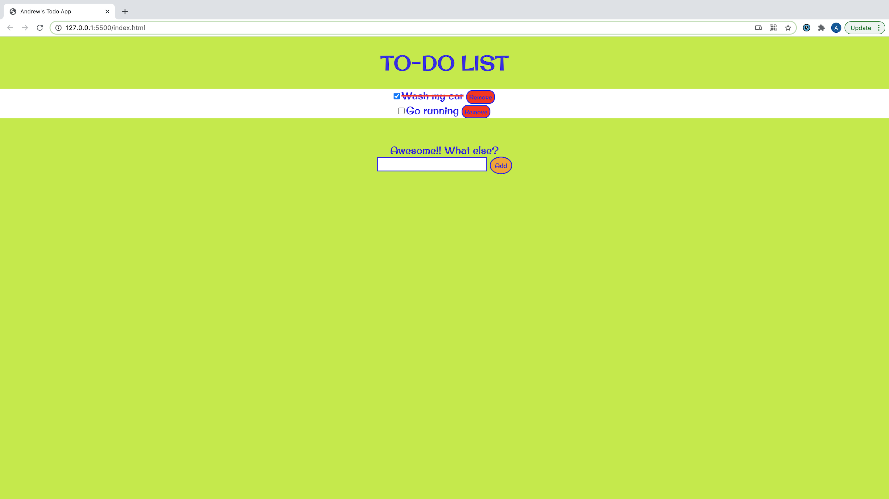

# TO-DO App using vanilla JavaScript

*A simple to-do application using only HTML, CSS, and JavaScript. No frameworks, etc. were used.*

Check it out here: https://andrew-k191.github.io/todo-app/

## Summary

A simple to-do application. This project was one of my assignments in the Software Development Mastermind Group. Athough it seems initially very easy to construct, I found this project very challenging. There were many things to consider for implenetation. For example, just configuring the delete button caused me many problems. Also, I realized how deficient are my skills/knowledge of CSS. Nevertheless, I found the exprience I gained invaluable and look forward to working on the next project!!:-)

## Author

* **Andrew Knight** - *Aspiring Software Developer* - (Website) | (LinkedIn)

